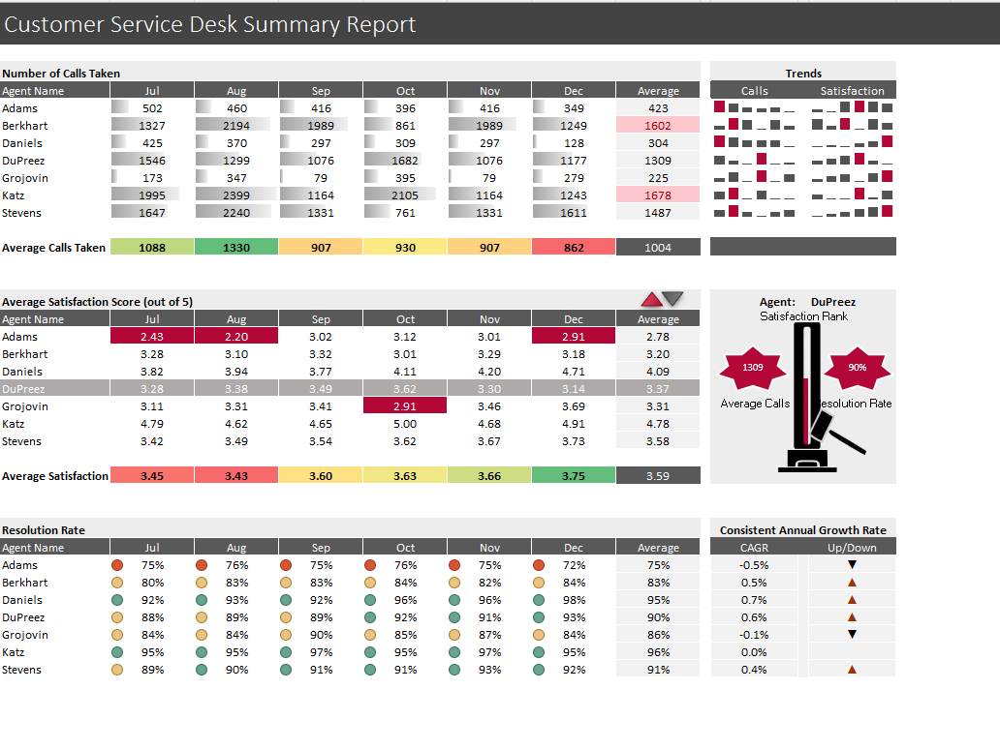

# Excel Business Logic & Analysis Practice Challenges

## Overview
This project contains a collection of Excel-based analytical and business logic challenges designed to demonstrate structured problem-solving using spreadsheet tools.

Each challenge focuses on transforming raw data into meaningful outputs through formulas, conditional logic, and structured analysis.

This type of work closely mirrors real-world analyst tasks such as data validation, rule-based decision making, and metric calculation.

---

## What This Project Demonstrates
- Translating business rules into Excel logic
- Working with structured datasets
- Applying conditional formulas
- Validating outputs against constraints
- Clear and organized spreadsheet design

---

## Skills & Tools Used
- Microsoft Excel (Advanced)
- Logical formulas (IF, AND, OR)
- Lookup functions
- Data validation
- Structured tables
- Analytical reasoning

---

## Screenshot Preview

---

## Use Case
These challenges reflect tasks commonly encountered by:
- Data Analysts
- Business Analysts
- Systems Analysts
- Operations Analysts

Examples include eligibility checks, rule-based classifications, and KPI logic validation.

---

